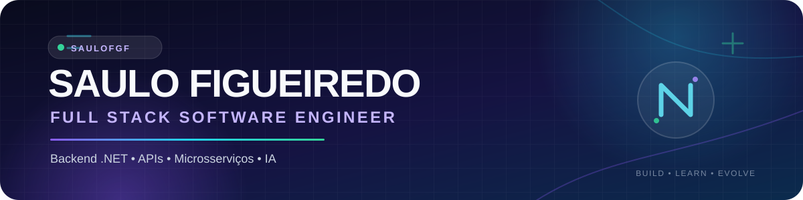
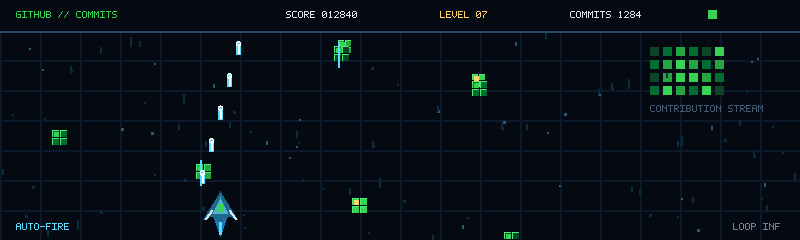

<p align="center">
  
</p>

<p align="center">
  <a href="https://readme-typing-svg.demolab.com" target="_blank" rel="noopener noreferrer">
    
  </a>
</p>

---

## 👨‍💻 Sobre Mim

Desenvolvedor **Full Stack** com experiência em aplicações corporativas utilizando **.NET, React, Node.js e TypeScript**. Atualmente atuo no desenvolvimento de **APIs, microsserviços e sistemas distribuídos**, incluindo a migração de aplicações legadas para uma arquitetura de microsserviços.

Ao longo da minha trajetória, também atuei com modelagem de dados em SQL e MongoDB, integração de APIs e construção de interfaces responsivas. Tenho grande interesse em **Arquitetura de Software**, **Integrações Financeiras** e **Inteligência Artificial**, sempre buscando transformar problemas de negócio em soluções simples, escaláveis e sustentáveis.

> **Especializado em:** .NET • APIs REST • Microsserviços • Integrações financeiras • Banco de Dados • Arquitetura de Software
>
> **Estudando:** DDD • Clean Architecture • Cloud Computing • Inteligência Artificial

## 🛠️ Tecnologias

### Backend

<p>
  <a href="https://learn.microsoft.com/dotnet/csharp/"></a>
  <a href="https://dotnet.microsoft.com/"></a>
  <a href="https://learn.microsoft.com/aspnet/core/"></a>
  <a href="https://nodejs.org/"></a>
  <a href="https://nestjs.com/"></a>
</p>

### Frontend

<p>
  <a href="https://react.dev/"></a>
  <a href="https://www.typescriptlang.org/"></a>
  <a href="https://nextjs.org/"></a>
</p>

### Banco de Dados

<p>
  <a href="https://learn.microsoft.com/sql/sql-server/"></a>
  <a href="https://www.postgresql.org/"></a>
  <a href="https://www.mongodb.com/"></a>
</p>

### Ferramentas

<p>
  <a href="https://www.docker.com/"></a>
  <a href="https://git-scm.com/"></a>
  <a href="https://github.com/SauloFGF"></a>
</p>

### Inteligência Artificial

<p>
  <a href="https://openai.com/"></a>
  <a href="https://github.com/features/copilot"></a>
  
  
</p>

## 📊 GitHub Stats

<p align="center">
  <a href="https://github.com/SauloFGF">
    
  </a>
  <a href="https://github.com/SauloFGF">
    
  </a>
</p>

<p align="center">
  <a href="https://github.com/SauloFGF">
    
  </a>
</p>

<p align="center">
  <a href="https://github.com/SauloFGF?tab=followers">
    
  </a>
  <a href="https://github.com/SauloFGF">
    
  </a>
</p>

<p align="center">
  <a href="https://github.com/SauloFGF">
    
  </a>
</p>

## 🚀 Projetos em Destaque

### Telegram VIP Manager

Sistema **Full Stack** para gerenciamento de grupos VIP do Telegram com integração PIX.

**Tecnologias:** NestJS • PostgreSQL • Prisma • JWT • Telegram Bot API • PagBank • Next.js

**Competências demonstradas:**
- Segurança e autenticação com JWT
- Integração de APIs e webhooks
- Processamento de pagamentos via PIX
- Modelagem de banco de dados
- Desenvolvimento Full Stack

[Conheça meus repositórios no GitHub →](https://github.com/SauloFGF?tab=repositories)

### Sistema de Geolocalização Google Maps

Sistema de geolocalização para facilitar a captação de candidatos com base em parâmetros definidos.

**Tecnologias:** React • .NET • Google Maps • APIs externas

**Competências demonstradas:**
- Integração com APIs externas
- Geolocalização e tratamento de dados
- Interfaces responsivas
- Desenvolvimento de aplicações corporativas

### Repositórios públicos relacionados

| Projeto | Descrição | Tecnologias |
| --- | --- | --- |
| [Enterprise Management System](https://github.com/SauloFGF/enterprise-management-system) | Sistema de gestão empresarial com módulos de login, clientes, produtos, pedidos e dashboard. | C# • .NET • React • TypeScript • PostgreSQL |
| [EcoTechApiT](https://github.com/SauloFGF/EcoTechApiT) | API desenvolvida em C# para estudo e evolução em soluções back-end. | C# • .NET |
| [fintech](https://github.com/SauloFGF/fintech) | Experimentos e estudos relacionados ao desenvolvimento de soluções fintech. | TypeScript |

## 🐍 Snake Animation

A animação abaixo percorre o histórico de contribuições do GitHub. O workflow configurado neste repositório gera os SVG e publica a branch `output` automaticamente a cada 12 horas.

<p align="center">
  <a href="https://github.com/SauloFGF/SauloFGF">
    <picture>
      <source media="(prefers-color-scheme: dark)" srcset="https://raw.githubusercontent.com/SauloFGF/SauloFGF/output/github-contribution-grid-snake-dark.svg" />
      <source media="(prefers-color-scheme: light)" srcset="https://raw.githubusercontent.com/SauloFGF/SauloFGF/output/github-contribution-grid-snake.svg" />
      
    </picture>
  </a>
</p>

<p align="center">
  <a href="https://github.com/SauloFGF/SauloFGF/actions/workflows/snake.yml">
    
  </a>
  
</p>

## 🎮 GitHub Shoot 'em Up

Animação arcade em loop inspirada no GitHub, no contribution graph e no fluxo de commits. A imagem final é independente: o GitHub apenas exibe o GIF, sem executar JavaScript, servidor ou qualquer aplicação.



### Gerar ou modificar a animação

O arquivo `generate.py` é necessário apenas para regenerar o GIF:

```bash
python -m pip install Pillow
python generate.py
```

O comando cria ou atualiza `github-shootemup.gif` na raiz deste repositório. Para usar em outro perfil, basta copiar o GIF e adicionar esta linha ao README:

```md

```

## 📫 Contato

<p align="center">
  <a href="https://www.linkedin.com/in/saulo-figueiredo-0b3743243" target="_blank" rel="noopener noreferrer">
    
  </a>
  <a href="https://github.com/SauloFGF" target="_blank" rel="noopener noreferrer">
    
  </a>
  <a href="https://www.linkedin.com/in/saulo-figueiredo-0b3743243" target="_blank" rel="noopener noreferrer">
    
  </a>
</p>

- **LinkedIn:** [saulo-figueiredo-0b3743243](https://www.linkedin.com/in/saulo-figueiredo-0b3743243)
- **GitHub:** [@SauloFGF](https://github.com/SauloFGF)
- **E-mail:** disponível mediante contato pelo LinkedIn.

---

<p align="center">Construindo software com propósito, segurança e curiosidade. <br />☕ <strong>Saulo Figueiredo</strong></p>
